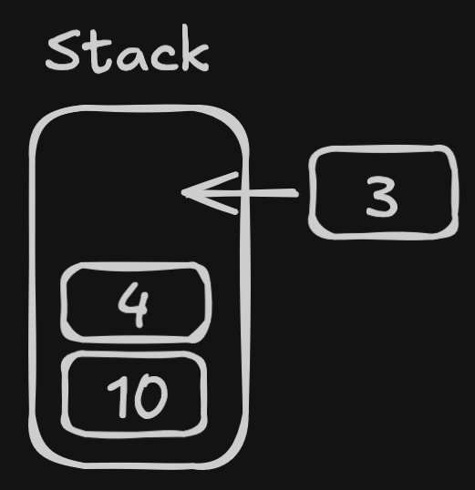

# Micro Code Documentation

## Qu'est-ce que micro_code
Micro_code est un bytecode conçu pour s'exécuter sur des microcontrôleurs 32-bits.
> Un bytecode c'est un format binaire intermédiaire entre le langage machine et le langage interprété.

Micro_code est principalement basé sur la `stack`, où la pile en français. On peut donc voir l'espace mémoire comme une pile où l'on ajoute des valeurs dessus et où l'on en retire.



## Le header
Un fichier binaire micro_code contient un 'header' qui est la partie stockant les informations utiles à la créations de la VM. \
Le premier élément est le 'magic number', un ensemble de deux nombres qui en ASCII équivalent à `MC`. C'est donc représenté par `Ox4D 0x43`. \
Ensuite c'est la taille de la stack qui est stockée dans deux octets en `little-endian`, ce qui signifie que pour avoir une stack de 4, on met `0x04 0x00` dans le header. \
Juste après c'est la taille de la RAM qui suit le même concept que celle de la stack. \
Et pour finir il reste un dernier octet qui spécifie si on a besoin d'un mode graphique ou non. 

Un header complet ressemble à ce qui suit.
```Hex
0x4D 0x43   ; Magic number
0x04 0x00   ; Stack size
0x40 0x00   ; RAM size
0x01        ; Graphic mode
```
Dans cet exemple on créé une VM avec une stack de 4, une RAM de 64 et on demande pour avoir un mode graphique sous forme de texte (console / terminal).

## Les instructions
Les instructions sont ce qui dit au processeur de faire qq chose, quoi faire, et avec quoi le faire.
Les différentes instructions sont détaillés dans le fichier [opcode](opcode).
